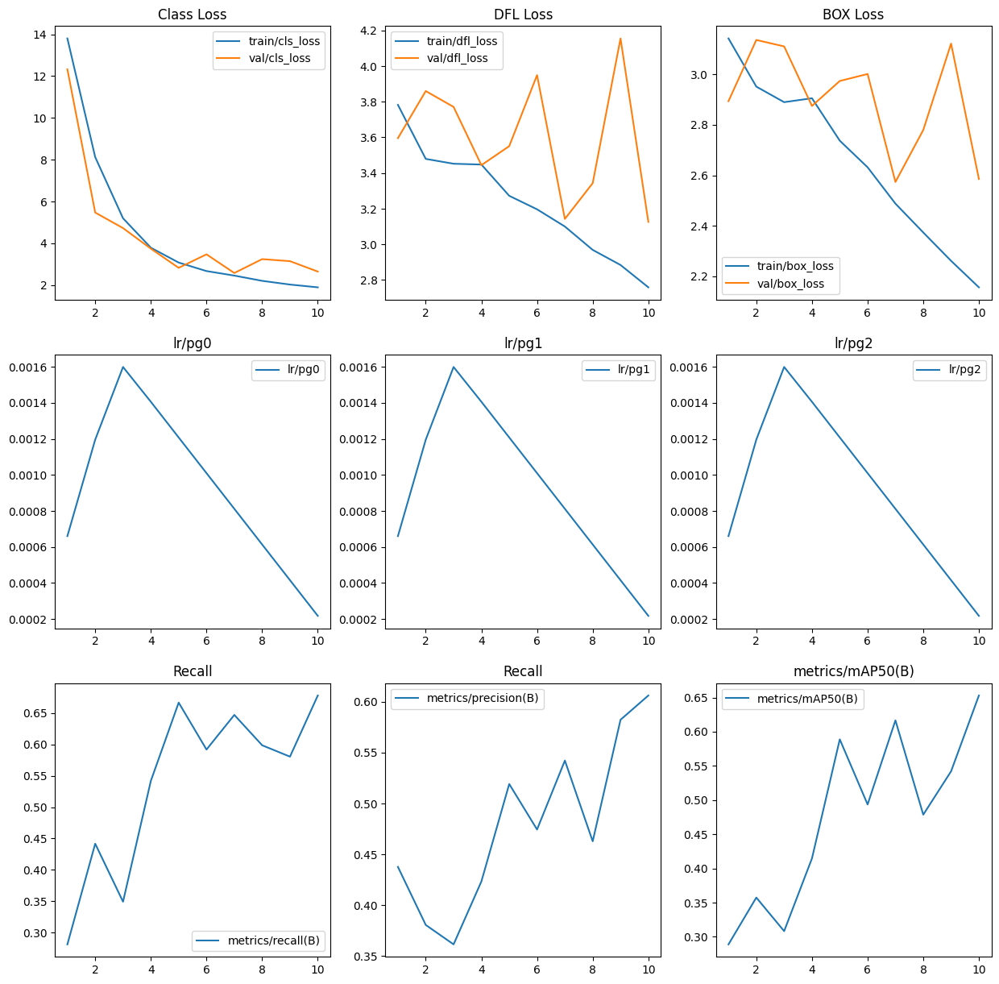

# Projek Deteksi Objek Wajah With `YOLOV10`

This project is a small project of mine which provides information on the use of YOLOV10 to be used as a face detector both in reltime and video files. if you want to see a folder that uses video files for object detection please see the `src/main_video.py` section. Then if you want to see the reltime camer usage, please open the file `src/main_camera.py`.

# Results from evaluation and testing of my project

I used the Transfer Learning technique and used my own data set to train the YOLO version 10 model. This model has been trained for 10 epochs. The results include loss metrics on training and validation data, as well as performance metrics such as precision, recall, and Mean Average Precision (mAP) at various thresholds.

Analisis:

1. Decrease in Loss

   - Train Box Loss: Decreased from 3.1419 in epoch 0 to 2.1563 in epoch 9, indicating an improvement in the model's ability to predict the bounding box.

   - Train Cls Loss: Significantly decreased from 13.8040 in epoch 0 to 1.8925 in epoch 9, indicating an improvement in object classification.

   - Train DFL Loss: Decreased from 3.7823 in epoch 0 to 2.7591 in epoch 9.

2. Performance Metrics:

   - Precision: Fluctuates, but tends to increase from 0.43763 in epoch 0 to 0.60606 in epoch 9.

   - Recall: Increased from 0.28118 in epoch 0 to 0.67800 in epoch 9.

   - mAP50: Increased from 0.28889 in epoch 0 to 0.65297 in epoch 9.

   - mAP50-95: Increased from 0.09902 in epoch 0 to 0.35013 in epoch 9.

3. Loss Validation

   - Val Box Loss: Shows fluctuations, but tends to decrease from 2.8936 in epoch 0 to 2.5854 in epoch 9.

   - Val Cls Loss: Significantly decreased from 12.3270 in epoch 0 to 2.6471 in epoch 9.

   - Val DFL Loss: Decreased from 3.5958 in epoch 0 to 3.1261 in epoch 9.

4. Learning Rate

   The learning rate decreased gradually from 0.000661 at epoch 0 to 0.000218 at epoch 9, following the learning rate decay pattern to avoid overshooting the model parameter updates.

So the YOLO Model version 10 that I trained using my own data set that I took in kaggle showed a very significant improvement in performance over 10 epochs of training. The decrease in train and val loss, as well as the increase in precision, recall, and mAP metrics show that the model is getting better at detecting and classifying objects. These results show that the model has learned well from the training data and is able to generalize to the validation data well.

# The following results will be shown on this `YOLOV10` model with the dataset that I provided in the form of a human face

**First result**

**Second result**

**Third result**

# Results of the YOLO version 10 model trial using mp4 video files

- Video Before object detection

[video_no_detection](src/data/WIN_20240715_15_12_59_Pro.mp4)

- Video After object detection

[vodeo_detection](src/data/outputHasilDeteksi.mp4)

# References

- Data for object detection : [Human Faces (Object Detection)](https://www.kaggle.com/datasets/sbaghbidi/human-faces-object-detection)

- Using Model : [YOLOV10](https://docs.ultralytics.com/models/yolov10/)

